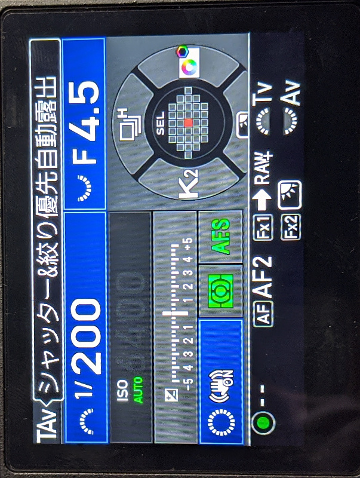
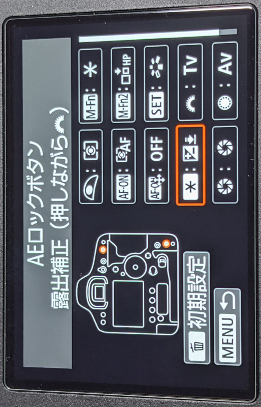

# そろそろペンタックスのTAvモードについて言っておくか

写真を構成する要素はいくつかありますが、「構図はセンス、露出は科学、ピントは技術」と言います(個人の意見です)。今回はそんな露出のお話です。

多くの場合において、カメラの撮影モードは「シャッタースピード優先(以下Tv)」「絞り優先(以下Av)」「マニュアル(以下M)」の3つの中から選択することになるでしょう。露出を決めるパラメータは、絞り、シャッタースピード、感度の3つです。AvやTvは、それぞれ絞り値ないしはシャッタースピードの片方をカメラマンが決定すると、最適露出を得るために必要なもう片方の値を自動的に求めて設定してくれれます。いわゆる自動露出(AE)というやつです。

露出を決定するパラメータは3つあると言いましたが、本当の意味で露出を左右するパラメータは感度だけです。絞りはボケ具合を、シャッタースピードはブレ具合をコントロールするためのパラメータであり、これらを変更すると、その副作用として露出が変化するだけに過ぎません。絞りやシャッタースピードは本来絵作りのためのパラメーターであり、これらを調整することで露出をコントロールしようとするのは本質的ではありません。

フィルム時代は、フィルムを装填してしまえば感度を変える術はありませんでした。露出を決定するためにカメラマンが操作できるものは、絞りとシャッタースピードしかなかったわけです。感度はフィルムを装填した時点で固定されているわけですから、絞り/シャッタースピードのどちらか片方を決めたのであれば、残されたもう一方の値は自動的に決定されます。そういう意味で、フィルム時代においてAv/Tvというモードは非常に合理的だったと言えるでしょう。

しかしデジタルカメラの時代になり、感度はいつでも自由に変更できるようになりました。そのため、絞り/シャッタースピードの片方を決定しただけでは、最適な露出は導けません。光線の状態に応じて、感度をカメラマンが手動で決定する必要があります。たとえばAvで撮るなら、絞り値と感度を決めることによって、はじめてシャッタースピードが自動的に決定されるわけです。

……あれ、これってそんなに便利じゃないのでは？ 最適な露出を自動的に計算するAEなのに、露出を決定するパラメータであるISO感度を手動で設定しないといけないって。3つのパラメータのうち2つを手動で決めてるのに、自動を名乗るとかおこがましくないですか？ そもそもAv/Tvというのは、風景であれば絞り、動物であればシャッタースピードなど、その撮影において支配的なパラメータを最低限手動で設定すれば、あとはカメラに任せることができるというモードです。しかし現実的には感度を手動で設定する必要があるわけです。たとえば日の出前から夢中で撮影していたら、いつの間にか太陽が昇りきっており、無駄に感度が高くてシャッタースピードが高速になった写真を量産した。そんなミスは誰にでも一度くらいはあるのではないでしょうか。

感度が自由に変更できるこの時代において、最適な露出を導くために感度を手動で設定し、絵作りに影響するパラメーターの片方をカメラ任せにするのは本末転倒なのではないかと考えます。絵作りに影響する絞りとシャッタースピードはカメラマンが意図して設定し、変化しても絵には(粗さ以外)影響しない感度のみをオートに任せるのがデジタル時代の合理的なAEじゃないでしょうか。

ペンタックスの「シャッター&絞り優先自動露出(以下TAv)」はこれを実現するモードです。絞りとシャッタースピードはカメラマンが手動で設定し、ISO感度のみが最適露出を導くためにオートで変化するモードです。絵作りと今のカメラの仕組みを考えると、実に自然なモードではないかと思います。

こんなに便利で、考えてみれば当然あってしかるべきなモードですが、ペンタックスのカメラにしか存在しません。その理由は、これがペンタックスの特許だからです。

特許公開番号[2008-070510](https://www.j-platpat.inpit.go.jp/c1800/PU/JP-2008-070510/38ED5EEB9E87963D3790206EFB8C47B4F1CF6154890108B2675E928BF292A785/11/ja) 「被写体の撮影状況が急激に変化するような場合であっても、安定して使用者が設定したシャッタ速度、及び絞り値を使って適正露出で撮像を行うことが可能な撮像装置」

## 他社製カメラでTAvを再現するには

さて、他社のカメラにおいて、M+ISOオートで同じことはできないでしょうか？

TAvのいいところは、マニュアル+ISOオートの状態で、露出補正が効くという点です。本来Mは絞りとシャッタースピードをカメラマンが設定し、そこにAEが介入する余地は一切ありません。そのためMモードでは露出補正は期待通りの動作をしません。たとえば1DX markIIIでは、M+ISOオートに設定した状態では、露出補正ボタンを押しながらサブダイヤルを回しても、露出補正値は一切変化しません。この挙動は当然といえば当然です。しかしTAvでは、Mのようにシャッタースピードと絞りを手動で設定した状態でも、露出補正を行えば、それに応じて感度が増減します。

なお1DX markIIIには裏技があり(マニュアルにも記載事態されているので裏ってほどじゃないけど)、ボタンカスタマイズで別のボタンに露出補正機能をアサインすると、M+ISOオートでも露出補正が動作するようになります。つまり1DX markIIIでペンタックスのTAvを擬似的に再現したければ、M+ISOオート+ボタンカスタマイズを設定しろということですね。

これは絞りとシャッタースピードは固定しつつも、明暗がコロコロと変化するようなシチュエーション、たとえば船上から動き回る動物を追うような場合に絶大な効果を発揮します。もうTAvがないと、不便すぎて動きもの撮れないですよね。

## ISOオートは悪なのか

(あとでかく)
